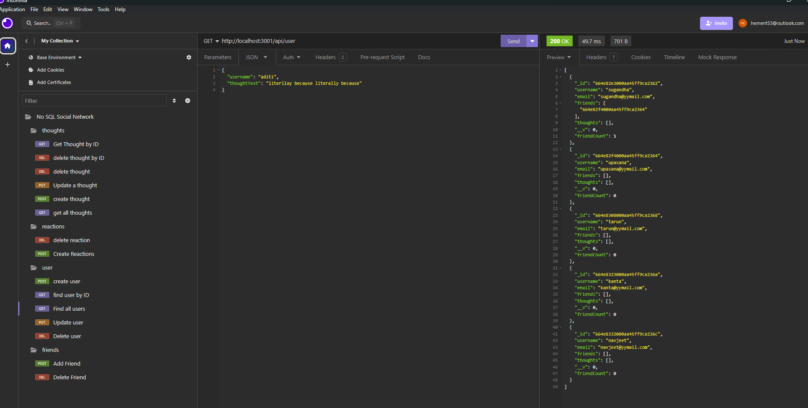
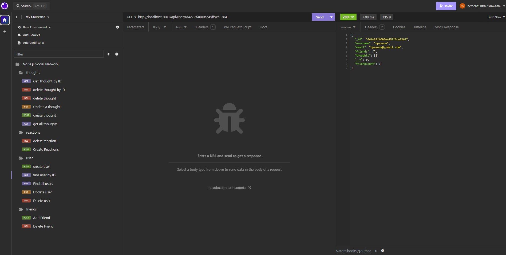
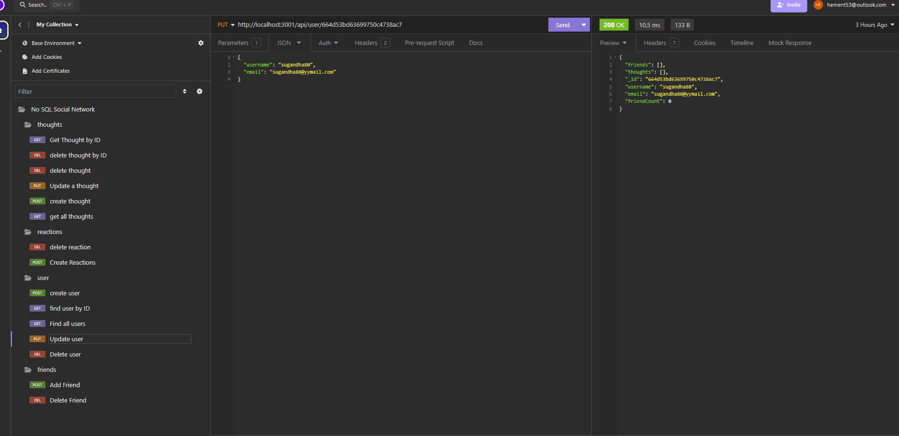
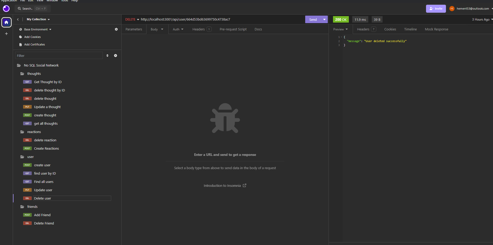
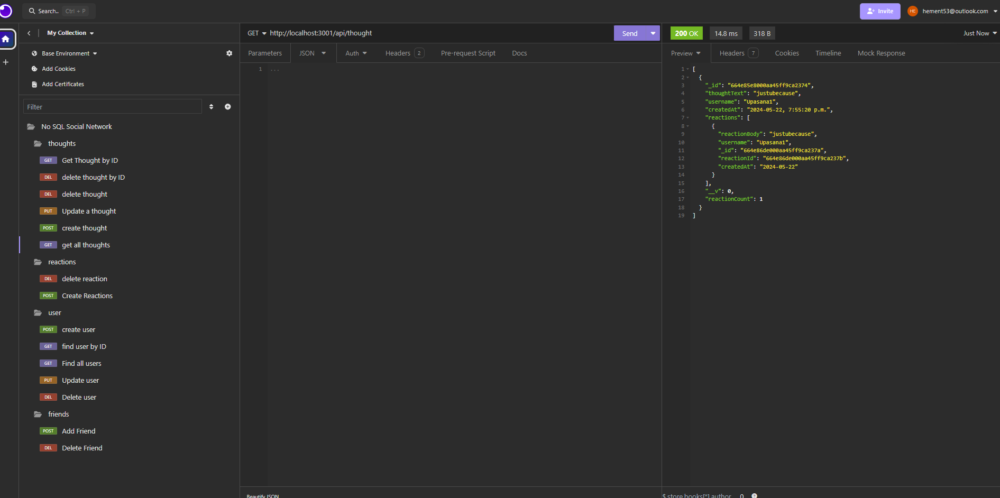
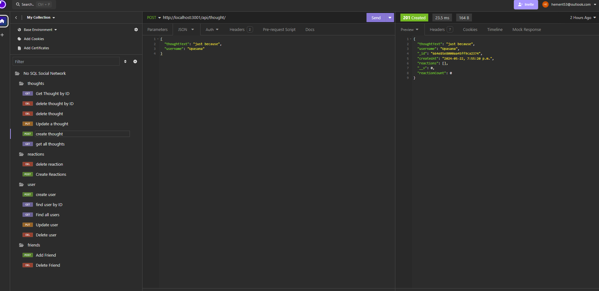
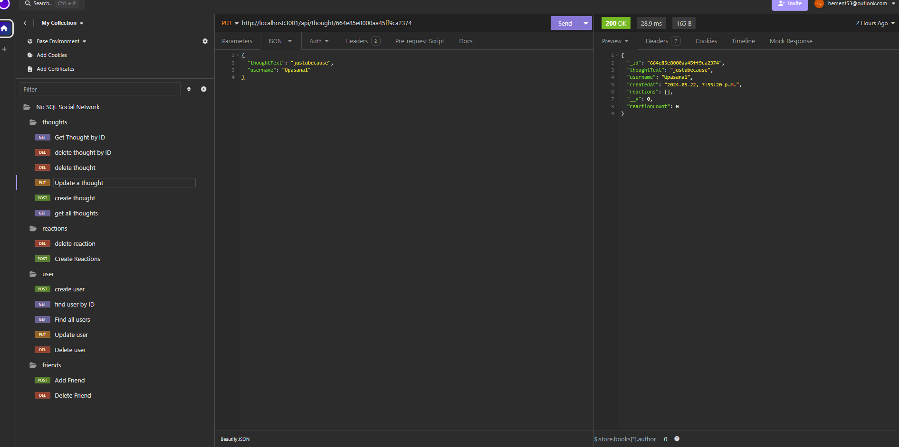
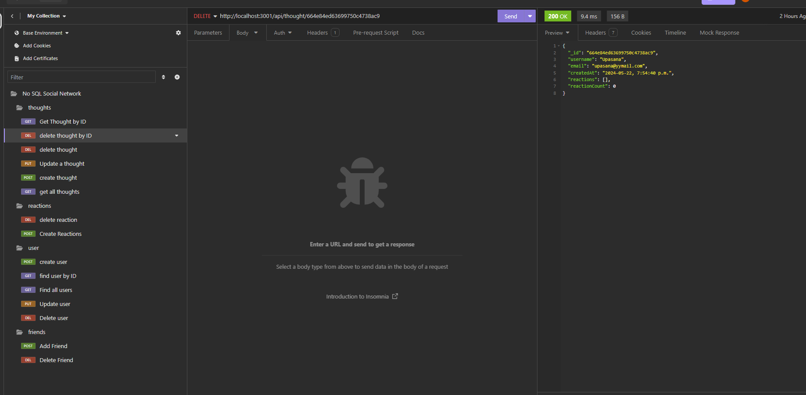
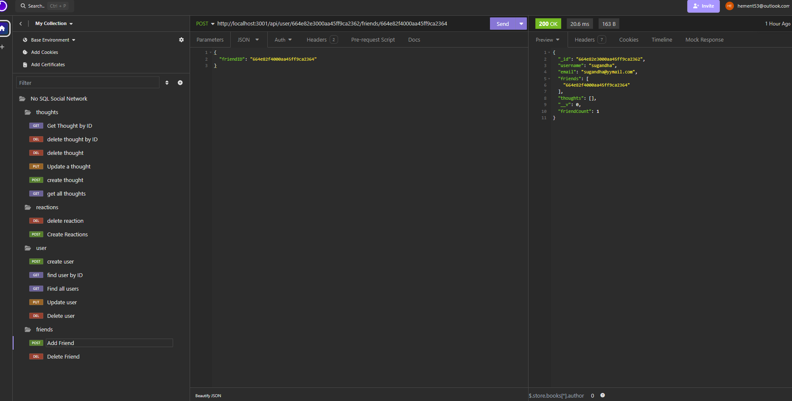

# Social Network API: "HementFriends"

# Description
Social Network API, "HementFriends," is a Node.js application interface (API) designed to facilitate CRUD operations on social networking data models using a NoSQL database. These models encompass friends, users, thoughts, and reactions, accessible individually by ID or collectively. Utilizing Node.js and Mongoose, this API provides a straightforward and scalable solution for managing social networking data, unencumbered by the constraints of traditional relational databases.

# Table of Contents

## The Challenge
## Usage Information
## Installation Process
## Built With
## Continued Development
## Deployed Application Link
## Github Repository
## YouTube Walkthrough Video
## Screenshots

## The Challenge
The task at hand was to develop a RESTful API capable of managing users, thoughts, and reactions data models for a social media startup, leveraging a NoSQL database. Crucially, the API needed to be built using Node.js and Mongoose and feature endpoints capable of handling substantial volumes of unstructured data.

## Usage Information

- Repository: After cloning the documentation, run npm i and update the .env file.
- Environment Variables: Create a .env file in the project's root directory and define the necessary variables.
- Testing the API: Once the server is running, utilize tools like Insomnia to test the API endpoints.
- Available Endpoints: Each endpoint should include the requisite data in the request body or URL parameters, as outlined in the acceptance criteria.

## Installation Process
- Clone the repository from GitHub or download the ZIP folder.
- Open the cloned or downloaded repository in any source code editor.
- Access the integrated terminal of the document and follow the provided installation guidelines under "Built With" to ensure operational readiness.

## Built With

Insomnia by Kong
MongoDB
Nodemon 2.0.12
License Badge by Shields.io
Visual Studio Code
JSON
Dynamic JavaScript
Mongoose 7.0.3
Express 4.18.2
Node.js 16.18.1

## Continued Development
- Enhance the user experience through the implementation of additional features.
- Improve error handling and response messaging to provide more informative user feedback.

## Deployed Application Link:
[Deployed Application Link:](https://github.com/hementB2/Social-Network-API)

## GitHub Repository:
[GitHub Repository:](https://github.com/hementB2/Social-Network-API)

## YouTube Walkthrough Video:
[Click Here to Watch](https://drive.google.com/file/d/1BHXElp9bRFOKFzBgqaEDGcyNDPfqymzX/view)

## Screenshots:

 
 
 
 
 

NoSQL Assignment
